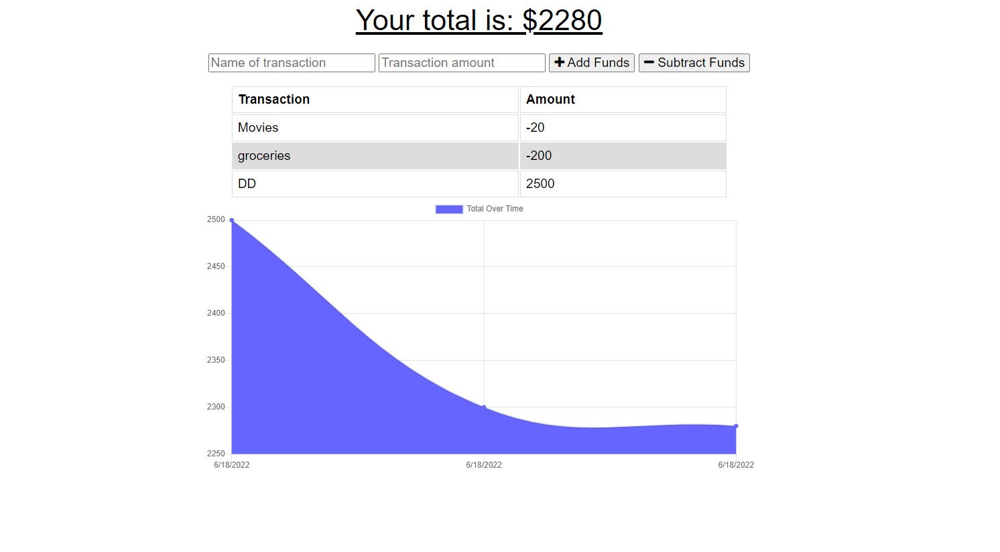

# Budget Tracker

A Budget Tracker application that allows users to add expenses and deposits to their budget with or without a connection. The user will be able to add expenses and deposits to their budget with or without a connection.  If the user enters transactions offline, the total should be updated when they're brought back online.

## Installation
1. Download or Clone repo
2. npm install the required npm packages to run

## Usage
* Application will be started by using the following command: <br>
``` npm start ```
* Open browser and type in: <br>
``` http://localhost:3001 ```
* User can add transactions with a name, transaction amount and transaction can be a deposit using ``` add funds ``` or withdrawal using ``` subtract funds ```
* The graph will portray total funds over time with date for each transaction
* 
* App is functional online and offline


## Heroku
https://budget-tracker-v-1.herokuapp.com/

## Features
* Node.js
* Express
* JavaScript
* MongoDB
* Mongoose
* PWA